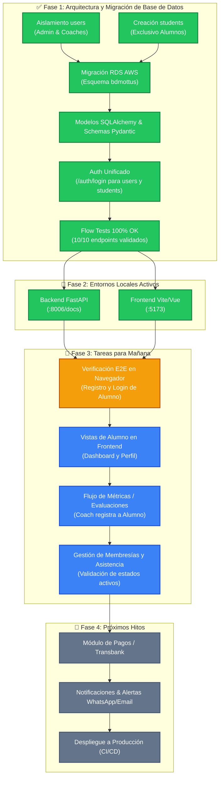

# 🗺️ Roadmap de Continuación del Proyecto Mottus

Este documento contiene el grafo de dependencias, estado actual del sistema y la hoja de ruta para continuar el desarrollo mañana.

---

## 📊 Grafo de Estado del Sistema y Próximos Pasos

---

## 📌 Resumen de Arquitectura Actual

| Capa | Componente | Detalle / Estado |
| :--- | :--- | :--- |
| **BD (PostgreSQL RDS)** | `bdmottus.users` | Exclusivo para administradores (`admin`) y entrenadores (`coach`). |
| **BD (PostgreSQL RDS)** | `bdmottus.students` | Exclusivo para alumnos. Maneja `medical_conditions`, `emergency_contact`, etc. |
| **Backend (FastAPI)** | `app/api/v1/auth.py` | Busca credenciales en `users` o `students` transparentemente. |
| **Backend (FastAPI)** | `app/api/v1/metrics.py` | FK `recorded_by` desacoplado para alumnos auto-registrados. |
| **Frontend (React/Vite)** | `src/services/api.js` | Conectado a `http://localhost:8006/api/v1` en dev y `/api/v1` en prod. |

---

## 📋 Plan de Acción Recomendado para Iniciar Mañana

1. **Revisión en el Navegador (`http://localhost:5173`)**:
   - Probar el formulario de Login y Registro de alumnos en la interfaz.
   - Confirmar que el token JWT devuelva el rol y active la sesión correcta.
2. **Dashboard de Alumno vs Coach**:
   - Ajustar las vistas del menú de navegación según el rol retornado (`student`, `coach`, `admin`).
3. **Flujo de Evaluaciones Físicas y Asistencias**:
   - Validar que un coach pueda seleccionar un alumno de la tabla `students` para registrar métricas corporales y asistencias.
